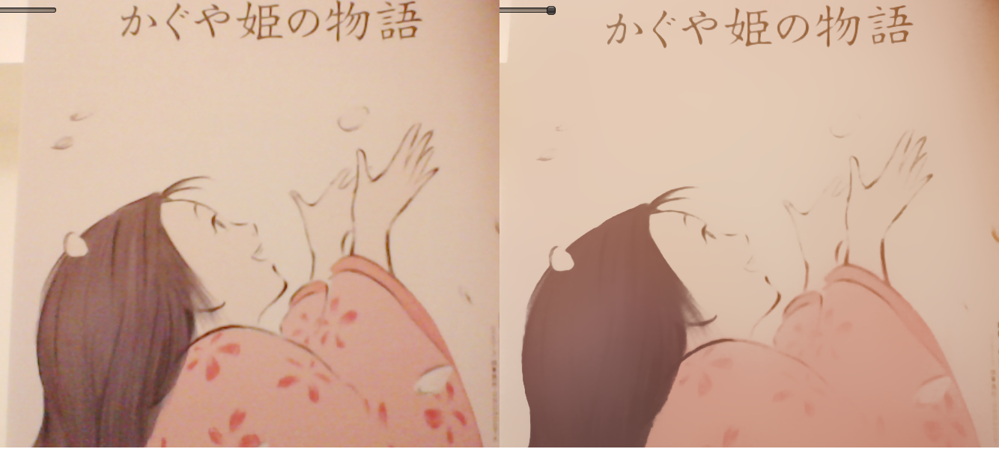

Real-Time Bilateral Filter for Unity
==============
Unity 用のリアルタイム「バイラテラルフィルタ」です。[Chen 2007] の手法を実装しています.

== 説明
 - バイラテラルフィルタとは、エッジを保存する「ガウシアンフィルタ」の事
 - ノイズなどを除去しつつも、特徴が失われない、応用範囲の広い画像フィルタ
 - 他の手法と違い、フィルタの効果が強い(ガウシアンの半径を広く取る)ほど高速化

== デモ
[Web Demo](http://nobnak.github.io/SceneSamples/RealTimeBilateralFilter/RealTimeBilateralFilter.html)

= 参考
 - Chen, J., Paris, S., & Durand, F. (2007). Real-time edge-aware image processing with the bilateral grid. ACM Transactions on Graphics (TOG), 1–9. Retrieved from http://dl.acm.org/citation.cfm?id=1276506
